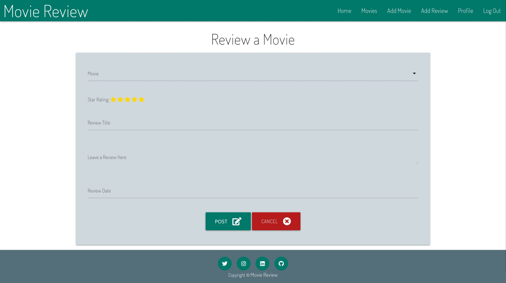
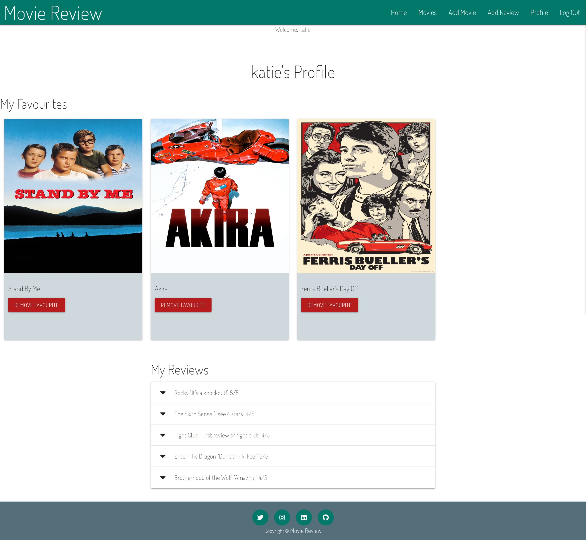

# MSP3 Movie Review Website


This is the Website for [Movie Review](https://the-snap-movie-review.herokuapp.com/). The purpose of this project is to create an 
interactive database of movies that allows users to create, read, update and delete data stored in the database. Non registered users 
can still use the site and search and find movies and the movie data. Registered users will be able to add a movie to the database, 
review a movie or add a movie to their favourites. Users can also edit/remove movies they have added, remove reviews they have created 
and remove movies from their favourites.

------

# User Experience (UX)


The goal of this project was to create a user driven movie review website that
uses MongoDB as a Non-relational database to manage the data. The site is 
responsive and incorporates the full CRUD functionality.

#### Non-registered user:
- A search box for user queries.
- A movies page that displays all movies individualy.
- A movie details page, displays all data stored for that movie.
- A login form page.
- A register form page.

#### Registered User:
- A search box for user queries.
- A movies page that displays all movies individualy.
- A movie details page, displays all data stored for that movie.
- An Edit movie button.
- Add to favorites button.
- Add a movie form page.
- Add a review form page.
- User Profile page.
- A delete Review button.
- A remove from favourites button.

#### Registered User but only for movies they added:
- A delete movie button. 


## Database Structure

The database consists of four collections - Genre, Movies, Review and Users.
When a User adds a movie the user can choose a genre_type from the Genres collection and their username is saved 
within the movie document under the field created_by. When a user adds a movie to their favourite the movie 
ObjectId is saved as an array in the user under the field favourite_movies. When the user adds a review for a movie 
the movie_title and the username are saved within the review document.   

1. Genre
```
{
"_id":{"$oid":"602f897a213c1ba7936838bd"},
"genre_type":"Action"
}
```
2. Movies
```
{
"_id":{"$oid":"60351299dba389836208022d"},
"movie_title":"The Goonies",
"director":" Richard Donner",
"genre_type":"Action",
"release_date":"12 November, 1985",
"actors":[
    "Sean Austin", 
    "Josh Brolin",
    "Corey Feldman",
    "Jeff Cohen",
    ],
"poster_image":"https://fanart.tv/fanart/movies/9340/movieposter/the-goonies-54ca9b11d2b2a.jpg",
"created_by":"katie","trailer":"https://www.youtube.com/embed/hJ2j4oWdQtU",
"classification":"12",
"run_time":"1h 54m",
"plot":"A group of young misfits called The Goonies discover an ancient map and set out on an adventure to find a legendary pirate's long-lost treasure.",
"favourite_count":{"$numberInt":"2"},
"itunes":"https://tv.apple.com/movie/the-goonies/umc.cmc.2qrqq24aa4jjhqmdl0kr3b6d0?itsct=tv_box&amp;itscg=30200",
"amazon":"https://www.amazon.co.uk/gp/video/detail/B00HDCZVHU/ref=atv_dp_share_cu_r"
}
```
3. Review
```
{
"_id":{"$oid":"604a1580eb3f5575c85c9254"},
"movie_title":"The Goonies",
"rating":"5",
"review_title":"Hey You Guys!",
"review":"All time favourite",
"review_date":"14 January, 2021",
"created_by":"lee"
}
```
4. Users
```
{
"_id":{"$oid":"602e4fa7001efe6ea23d129c"},
"username":"lee",
"password":"pbkdf2:sha256:150000$kQkwtmev$5aa2de4cd8f41dfc879332f1563bf3a31794a5c4b4e926ca56bbfdb6f51ed5aa",
"favourite_movies":[
    {"$oid":"603d04877eb04b70e0b1f2a1"},
    {"$oid":"60351299dba389836208022d"}
    ]
}
```

## User stories

### External User Goals:
As a user I would like...
* to easily search the site for Movies that interest me.
* to be able to see key information regarding this movie.
* to be able to leave a review. 
* to add missing movie titles.
* to be able to see movies I have liked and reviews i have left.
* to be able to change or delete any reviews I have left.
* to be able to change or delete any movies I have added.

### Site Owner's Goals:
* I want the users to be able to navigate the site easily.
* I want the users to leave reviews on the site.
* I want the users to be able to follow a link to buy the movie. 


## Design

### Colour Scheme:

The colours used throughout the app are Materialized colours
- blue-grey darken-1 used for the background colour for cards and forms
- teal lighten-1 was used for the Navbar and buttons.
- blue-grey-text text-lighten-5 was used on all input fields on the forms.

### Typography: 
    
The Font Dosis was used from google fonts.
        
### Imagery:  

The main image has been chosen to be eye catching and refrences what the website is about.  
The images for the movies have been chosen  so users can identify the film on recognisable images. 
    
    
### Wireframes:
The [Movie Review](docs/MovieReview.pdf) wireframes can be found here.
 

# Features

## Existing Features

*  Navbar - The Navbar allows users an easy navigation through the site for registered and non-registered users. 
*  Homepage - The homepage welcomes new users with a brief explination and offers the users to find a movie, register or log in. 
*  All Movies - The Movie Page displays all movies alphabeticaly as cards. The movie poster and the movie title are the main 
card content but when the card reveal is clicked the movie information is displayed and users can click on the more information 
to be directed to the movie details page.   
*  Search Bar - The search bar in the Movies page allows users to search for film titles, actors name or a directors name and returns
users query. The reset button removes users query and returns all movies. 
*  Movie Detail Page - The Movie details page can be accessed by all users via the card revealon the movies page. This page displays more 
information regarding the movie and shows all reviews of this movie and allows users to view the movie trailer. The close icon at top right 
allows users to close this view and return back to all movies.
*  Register - Each user has the opportunity to register an account and have access to additional features such as adding to favourites, editing, 
deleting and creating movies and the ability to add and delete reviews.
*  Add & Edit Movies - As part of the CRUD funtion required for this site, registered users
can create a new Movies by using the Add movie link in the Navbar. Users can update the movie details of the movies they 
have added using the visable link in the card reveal panel on the movie cards. 
*  Delete Movies - Another part of the CRUD function required users can delete the movie they 
have added by using the visable link in the card reveal panel on the movie cards.
*  Add/Remove Movies to/from Favourites - Registered users who are logged in will see the option to add a movie to their favourites by clicking the heart icon
on the movie details page.
*  Add Reviews - As part of the CRUD funtion required for this site, registered users
can create a review of the movies by using the Add Review link in the Navbar. these reviews are displayed in the movie details page and on the user profile page.
*  Delete Reviews - Another part of the CRUD function required users can delete any of their own reviews.
*  User Profile Page - The users profile page displays the username at the top of the page along with any reviews they have left and also any films added to their
favourites.
*  Back to Top - the get_movies.html page features a fixed back to top button that allows users to return to the top of the page. 

## Future Development
* Users ability to edit their profile page, change username and reset password.
* Return review rating value to 5 stars instaead of value.

# Technologies Used
 
 **Languages Used** 
- HTML
- CSS
- Python
 

**Frameworks, Libraries & Programs Used**
   
[Materialize](https://materializecss.com/):
 Materialize was used as an alternative to bootstrap and was used to ensure the site was responsive
 and 

[Font Awesome](https://fontawesome.com/):
 Font Awesome was used to provide the Icons throughout this website.

[Google Fonts](https://fonts.google.com/):
 Google fonts was used to import the font into the style.css file

[JQuery](https://jquery.com/):
 JQuery was used to run the scripts for the following:
 - to create a mobile sidenav.
 - to activate the collapsible headers.
 - to enable the drop down select options on the forms.
 - to change the rating value in the input to star rating.
 - to enable the confirmation modal.
 - to enable the datepicker input on forms.
 - to add validation colour on input fields on the form.
 - to enable the back to top button.


[Git](https://git-scm.com/): 
 Git was used by utilizing the Gitpod terminal to commit to Git and push to GitHub.

[GitHub](https://github.com/):
 GitHub was used to create a repository and store the code after it was pushed from Git.

[Heroku](https://www.heroku.com):
 Heroku was used to deploy my app.

[Balsamiq](https://balsamiq.com/):
 Wireframes were created using Balsamiq

[Pixabay](https://pixabay.com/):
 Pixabay was used to source the background imagery for the webpage.

[MONGODB](https://www.mongodb.com/):
 MongoDB was used to create and store data in my collection

[Flask](https://flask.palletsprojects.com/en/1.1.x/):
 Flask was used to create a base template that allowed us to Jinja for template inheritance and for-loops.

[YouTube](https://www.youtube.com/):
 YouTube was used to source the embeded movie trailers. 

[Giphy](https://giphy.com/):
 Giphy was used to source the images for the Error 403, 404, 410 & 500.html pages.

# Testing
### Code Validation
The Freeformatter HTML Validator and W3C CSS Validator were used to validate every page of the project to ensure there were no errors in the project.

[CSS Validator](http://jigsaw.w3.org/css-validator/) - [Results](docs/CSS validator.jpeg)

[HTML Validator](https://validator.w3.org/) - [Results]()

[JSHint](https://jshint.com/) - [Results](docs/jshint.jpeg)

### Devices
The website was tested on laptop, desktop, iphone, ipad on the following browsers:
- Google Chrome
- Microsoft Edge
- Safari
- Firefox 

### Manual Tests for functionality of features
### 1. Responsive on all devices 
- Chrome Dev Tools was used to check the sites compatiability all all devices. A link to the site was tested on iphone and ipad.
### 2. Navbar 
- The Navbar links were all tested on the main navbar and the sidenav for small screen resolutions.
### 3. Homepage 
- The homepage links for find a movie, register or log in were all clicked and testd. 
### 4. All Movies 
- All movie cards were tested to ensure that the correct movie details were revealed and that the correct buttons for registered 
and non-registered users, the add a review, edit movie and delete movie links were tested. The view movie details buttons were tested
on all movie cards.     
### 5. Search Bar 
- The search bar was tested and random film titles, actors name and directors name were searched for and the reset button 
was clicked and all movies were returned. 
### 6. Movie Detail Page 
- The Movie details button was clicked and the movie_detials were returned all movies were tested.
- The collapsible list for the reviews was tested to ensure all review details for that movie. 
- The movie trailers were tested to ensure they played.
- The Amazon/itunes links were tested to ensure they returned the correct details. 
- The close icon at top right was tested to ensure that the movie details was closed and returns user to the all movies page. 
### 7. Register 
- The registration form was tested to register new users to the database. 
### 8. Add Movie
- The add movie form was used to add 120 movies to the site.
- After each movie was added the search bar was tested to return the new movie.
- The card reveal was tested to see if the relevant movie info was displayed.
- The view movie details button was clicked and all the links were tested.
### 9. Edit Movie
- The edit movie button was clicked to randomly update different fields for individual movies.
- The visability of the edit movie button was tested to ensure it was visible for all users and
not visable for non-registered users.
### 10. Delete Movies 
- Several movies were added and deleted to ensure the movie was removed from the database and website.
- The visability of the delete movie button was tested to ensure it was visible for the creator of the movie
and not visable for other users and non-registered users.
### 11. Add/Remove Movies to/from Favourites 
- The add to favourite button was tested on selected movies to ensure the movie appears on users profile page and is 
stored in the database under the users collection and the favourite_count was increased by 1.
- The remove favourite was tested to remove mutiple movies from different users profiles and checked the users collection
in the database and also checked the favourite_count in the movies collection to ensure it was reduced by 1.
### 12. Add Reviews 
- The add review link in the card reveal panel and in the navbar were tested and used to add a number of reviews to random movies
- The profile page was checked to ensure that the users added reviews appeared for that user.
- The movie details paged was checked to ensure that reviews created appeared.
### 13. Delete Reviews
- The delete review button on the profile page was clicked to remove selected reviews.
### 14. User Profile Page
- The profile page was tested to check that the users username, their favourited movies and their created reviews are displayed  
### 15. Back to Top
- The button was clicked to check users are returned to the top of the page.
### 16. Footer social links
- All the links in the footer were clicked on to ensure that a new window opens for the appropriate link. 

## Testing User Stories

**External User Goals:**
    
* to easily search the site for Movies that interest me.

    (a) The Navbar helps users navigate the site. 

    (b) The Search bar allows users to enter actors, movie titles or directors 
    

* to be able to see key information regarding this movie.

    (a) The user can see basic movie deatails on the card reveal.
    

    (b)The user can see all movie deatails stored in the database on the movie_details.page.
    

* to be able to leave a review. 

    (a) The user can click on the link in the card reveal.

    (b) The user can leave a review by clicking on the navbar link and filling in the form.
    The user can see basic movie deatails on the card reveal.
    

* to add missing movie titles.

    (a) Users can add missing movies by clicking the add movie button in the navbar.
    and complete the details on the form.
    

* to be able to see movies I have liked and reviews i have left.
    
    (a) Users can add movies to their favourites by clicking the add to favourites button
    in the movie details page. 

    (b) The profile page allows users to see their favourite movies and reviews they created.
    

* to be able to change or delete any reviews I have left.

    (a) Users can delete any of their reviews from the profile
    

* to be able to change or delete any movies I have added. 

    (a) Users can edit any movies on the database by clicking the edit button
    on the card reveal panel.

    (b) Users can delete only movies they have added by clicking the delete button
    on the card reveal panel.

### Site Owner's Goals:
* I want the users to be able to navigate the site easily.

    (a) The navbar allows users to navigate through the site.

    (b) All forms have a close or cancel button to allow users to return back to main movies page.

* I want the users to leave reviews on the site.

    (a) Registered users can add review by the main navbar or via the card panel.

* I want the users to be able to follow a link to buy the movie. 

    (a) The user can follow the links in the movie details page to Amazon or Itunes.
    
## Bugs
- A movie with a really long movie title forces the cards to display with blank spaces.


# Deployment 

The project was deployed to [Heroku](https://dashboard.heroku.com/apps) Pages using the following steps...

To deploy the project on heroku, take the following steps:

1. If not already present, create a requirements.txt file using the command:


    pip freeze > requirements.txt


2. If not already present, create a `Procfile` with the command:

    echo web: python app.py > Procfile


3. Push the the project to GitHub.

4. Log in to your Heroku account and create a new app on the [Heroku website](https://dashboard.heroku.com/apps) by clicking the 
"New" button in your dashboard. Give it a name and set the region to the one closest to you, then click the "Create app" button.

5.  Click on "Deploy" tab and under "Deployment method" and select GitHub. Select the correct repository and click "Connect".

6. Click on the "Settings" tab and under "Config Vars" click "Reveal Config Vars" and enter the Key and values stored in
the env.py file:
                 
    - IP                  
    - PORT               
    - SECRET_KEY          
    - MONGO_URI
    - MONGO_DBNAME
  

7. In the "Manual Deployment" section of this page, make sure the master branch is selected and then click "Deploy Branch".

8. The site is now successfully deployed, click the "Open app" button to visit it.


# Credits

**Code**
* Error Pages - [Flask Pallets Projects](https://flask.palletsprojects.com/en/1.1.x/patterns/errorpages/) was read to understand how to create
custom error pages.


**Content & Media**

- The Homepage background image was sourced from [Pixabay](https://pixabay.com/photos/starwars-fantasy-movie-figure-5355787/) and the authours was enriquelopezgarre 
- All other images are links to the url from google search for movie posters
- Giphy was used to source the Images on the error pages.


**Acknowledgements**

* My Mentor Aaron Sinnott for feedback
* Code Institute for training


 